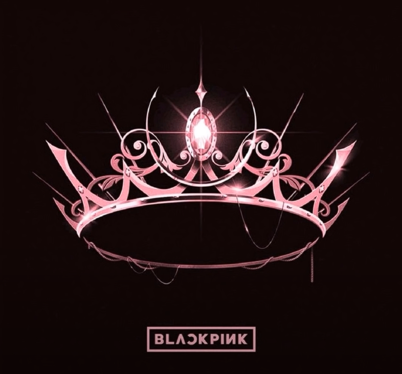

<div align="center">

# BLACKPINK Official Fan Page



*A premium, cinematic fan page for the world's biggest K-pop girl group*

[](https://developer.mozilla.org/en-US/docs/Web/HTML)
[](https://developer.mozilla.org/en-US/docs/Web/CSS)
[](https://developer.mozilla.org/en-US/docs/Web/JavaScript)
[](LICENSE)

*Premium fan page inspired by Apple, Spotify, Netflix, and HYBE design aesthetics*

</div>

---

## ✨ Features

### 🎨 Premium Design
- **Cinematic visuals** with elegant animations and micro-interactions
- **Glassmorphism effects** on navigation and cards
- **Dynamic hero section** with animated particles and lighting
- **Luxury typography** using Playfair Display & Outfit fonts
- **Black & Pink** signature color scheme with modern gradients

### 📱 Fully Responsive
- **Desktop** - Full immersive experience
- **Tablet** - Optimized layout and interactions
- **Mobile** - Smooth touch-friendly interface

### ⚡ Performance
- **Smooth 60fps animations** using CSS transforms
- **Optimized rendering** with requestAnimationFrame
- **Intersection Observer** for efficient scroll animations
- **Reduced motion support** for accessibility

### 🎬 Sections
| Section | Description |
|---------|-------------|
| **Hero** | Animated title with particles and cinematic glow |
| **Members** | Jisoo, Jennie, Rosé & Lisa profiles with hover effects |
| **Music** | Album gallery with premium card styling |
| **Videos** | Embedded video player with poster image |
| **Tour** | Auto-playing background video loop |
| **Join BLINK** | Newsletter subscription with country selector |

---

## 🚀 Quick Start

1. **Clone the repository**
```bash
git clone https://github.com/Julio-73/Black-Pink-Oficial.git
cd Black-Pink-Oficial
npm install
```

2. **Optimize assets (one-time)**
```bash
npm run build      # icons + images + videos + validation
```

3. **Serve locally**
```bash
npm run serve      # http://localhost:3000
```

> ES modules require an HTTP server. Opening `index.html` via `file://` will fail.

### Available scripts
| Command | What it does |
|---|---|
| `npm run serve` | Local dev server on :3000 |
| `npm run optimize` | Regenerate PWA icons + optimized images + videos |
| `npm run optimize:images` | Convert PNG → AVIF+WebP+PNG @2 sizes |
| `npm run optimize:videos` | Trim + compress MP4/WebM + poster frames |
| `npm run optimize:icons` | Generate PWA icons (192/512/maskable/apple) |
| `npm run validate` | Run SEO + a11y audits |
| `npm run audit` | Full project metrics report |
| `npm run build` | Full pipeline: optimize + validate |

---

## 📊 Performance

- **Total shipped**: ~3.7MB (vs ~175MB original) — **97% reduction**
- **First-load gzipped**: **44KB** (HTML + CSS + JS)
- **Video**: trimmed 3-min loops → 15s + H.264 + VP9 dual-stream
- **Images**: AVIF (10) + WebP (10) + PNG fallback (10) at 2 sizes
- **JS**: 12 modules ES6, gzipped total 17KB
- **No bundler**: native ES modules with HTTP/2 multiplexing
- **Service worker**: precache 18 critical assets for offline

Run `npm run audit` for full metrics.

---

## 🔍 SEO & Rich Results

- ✅ JSON-LD: `WebSite`, `Organization`, **`MusicGroup`** (4 members with birthDate/role/nationality + 6 sameAs)
- ✅ Open Graph: 15 properties (image, locale, alternate locales, dimensions)
- ✅ Twitter Cards: summary_large_image
- ✅ Canonical URL + hreflang (es/en/ko)
- ✅ Sitemap.xml + robots.txt
- ✅ Theme color light/dark + color-scheme

Test with:
- [Google Rich Results Test](https://search.google.com/test/rich-results)
- [opengraph.xyz](https://www.opengraph.xyz/)

---

## ♿ Accessibility

- ✅ `<main>` landmark + skip-to-content link
- ✅ Focus trap in modals + focus restoration on close
- ✅ Esc closes modals
- ✅ Forms: 5 labels (sr-only), `aria-required`, live `aria-invalid` validation
- ✅ Quiz result: `aria-live="polite"` announces member name on reveal
- ✅ Video player + audio controls: full `aria-label`s
- ✅ `:focus-visible` outline (3px pink) replaces all `outline: none`
- ✅ `@media (prefers-reduced-motion: reduce)` — disables all animations
- ✅ `@media (prefers-contrast: more)` — high-contrast outline + underlines
- ✅ Modals: `role="dialog"`, `aria-modal="true"`, `aria-labelledby`
- ✅ Language buttons: `aria-pressed`
- ✅ Video cards: `role="button"`, `tabindex="0"`
- ✅ Headings: 1 h1, 13 h2, 11 h3, 17 h4 (no skipped levels)

Validate with:
- Chrome DevTools → Lighthouse → Accessibility
- [axe DevTools](https://www.deque.com/axe/devtools/) browser extension
- [WAVE](https://wave.webaim.org/)

---

## 📦 PWA (Progressive Web App)

- ✅ Installable on iOS, Android, Desktop
- ✅ Custom theme color (hot pink) + status bar
- ✅ Maskable icon (Android adaptive)
- ✅ App shortcuts: Test BLINK, Tour
- ✅ Offline: 18 precached assets, network-first for navigations
- ✅ Apple touch icon + mask-icon (Safari pinned tab)

---

```
Black-Pink-Oficial/
├── 📄 index.html              # Main HTML (with JSON-LD, OG, Twitter, PWA links)
├── 🎨 page.css                # Premium styles (a11y utilities included)
├── 📋 manifest.json           # PWA manifest (icons, shortcuts, screenshots)
├── ⚙️ sw.js                   # Service worker (precache, cache-first)
├── 🤖 robots.txt              # Crawler rules + sitemap ref
├── 🗺️ sitemap.xml             # Sitemap (hreflang)
│
├── ⚡ js/                     # 12 ES6 modules (no bundler)
│   ├── main.js                # Entry + delegated click dispatcher
│   ├── toast.js               # ARIA-live notifications
│   ├── nav.js                 # Header, mobile menu, scroll progress
│   ├── modals.js              # Member + video modals (focus trap)
│   ├── videos.js              # Video tabs
│   ├── cart.js                # Merch cart (localStorage)
│   ├── forms.js               # Join BLINK form (a11y validated)
│   ├── countdown.js           # Comeback timer (dynamic)
│   ├── map.js                 # Leaflet world tour map
│   ├── effects.js             # Reveal, parallax, particles, tilt, confetti
│   ├── player.js              # Music player + visualizer + mini-player
│   └── quiz.js                # BLINK personality test + VIP pass canvas
│
├── 🖼️ img/                    # Optimized images
│   ├── *.avif  *.webp  *.png   # 5 members × 2 sizes × 3 formats = 30 files
│   └── pwa/                   # App icons (192/512/maskable/apple)
│
├── 🎬 video/                  # Compressed videos
│   ├── *.mp4  *.webm          # H.264 + VP9 dual-stream
│   └── *-poster.webp          # Poster frames
│
├── 🛠️ scripts/                # Build & audit scripts
│   ├── optimize-images.mjs    # sharp: PNG → AVIF+WebP+PNG
│   ├── optimize-videos.mjs    # ffmpeg: trim + H.264 + VP9
│   ├── generate-pwa-icons.mjs # 192/512/maskable/apple
│   ├── generate-screenshot.mjs
│   ├── refactor-html.mjs      # One-shot HTML refactor (data-action)
│   ├── validate-seo.mjs       # JSON-LD, manifest, OG, Twitter
│   ├── audit-a11y.mjs         # Landmarks, aria, headings
│   └── audit.mjs              # Full project metrics
│
├── 🗃️ assets/originals/       # Source files (gitignored)
└── 📝 README.md
```

---

## 🎯 Design Inspiration

<div align="center">

| Style | Inspiration |
|-------|-------------|
| **Typography** | Apple, Vogue, Spotify |
| **Animations** | Netflix, Tesla |
| **Layout** | HYBE, YG Entertainment |
| **Colors** | Blackpink's signature black & pink |

</div>

---

## 🌐 Browser Support

| Browser | Version |
|---------|---------|
| Chrome  | 90+     |
| Firefox | 88+     |
| Safari  | 14+     |
| Edge    | 90+     |

ES modules + AVIF + service workers required. No IE support.

---

## 🚢 Deployment

### GitHub Pages
1. Push to `main` branch
2. Settings → Pages → Source: `main` / `/` (root)
3. URL: `https://<user>.github.io/Black-Pink-Oficial/`
4. Update canonical URL in `index.html` and `sitemap.xml` if different

### Vercel / Netlify
- Build command: `npm run build`
- Output: `./` (static)
- Add headers for cache (`Cache-Control: max-age=31536000, immutable` for `/img/` and `/js/`)

### Important after deploying
- Update `<link rel="canonical">` in `index.html` (search for `julio-73`)
- Update `og:url`, `og:image`, `twitter:image` to absolute URL
- Update `<loc>` in `sitemap.xml`
- Update `Sitemap:` line in `robots.txt`
- Re-run `npm run validate:seo` to verify

---

## 📝 License

This is a **fan page** for educational and entertainment purposes.
All BLACKPINK content, images, and trademarks belong to YG Entertainment.

```
© 2024 BLACKPINK. All Rights Reserved.
© YG Entertainment. All Rights Reserved.
```

---

## 👨‍💻 Author

<div align="center">

**Created with ❤️ by Julio-73**

*Premium K-pop Fan Page*

---

⭐ Star this repository if you like it!

</div>